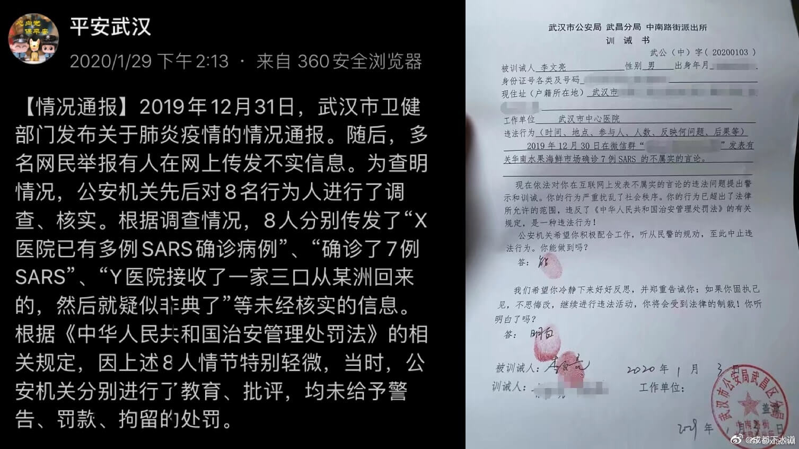
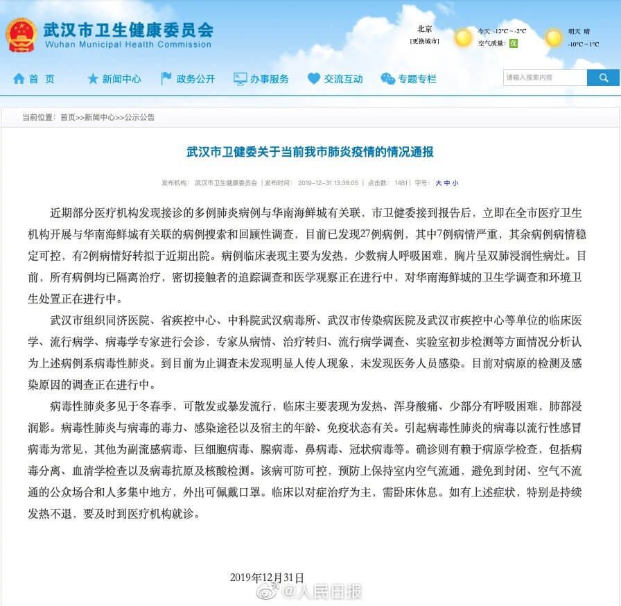
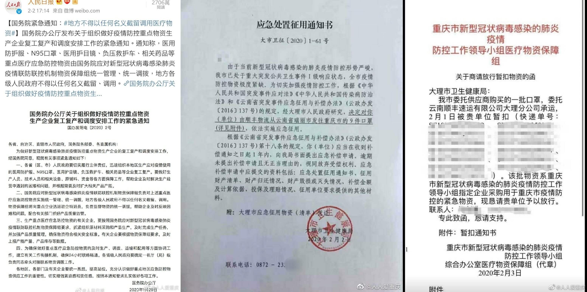
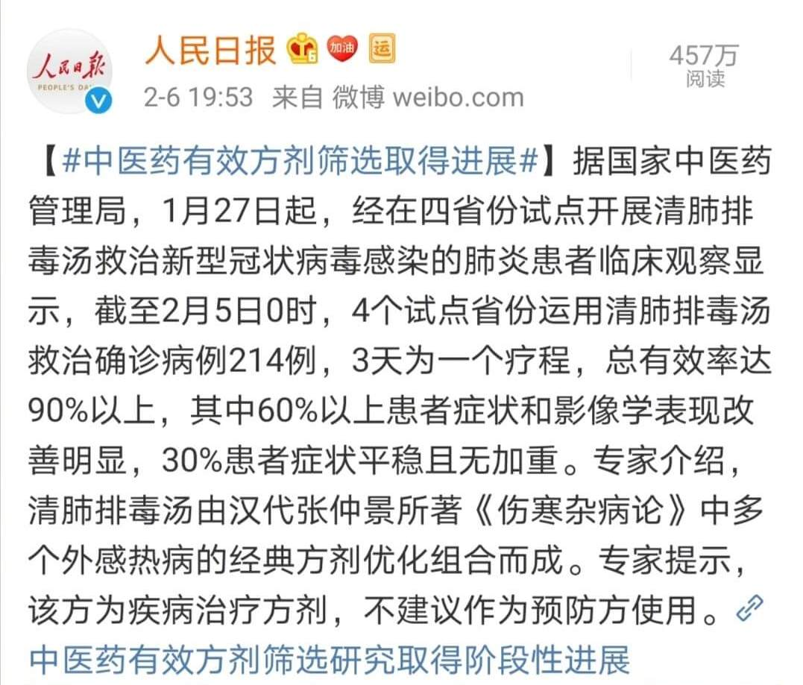

> 2019 肺炎期间一系列骚操作令人大跌眼镜，所以收集公开可证实的黑名单。备忘、排雷和警戒。

### 🚫武汉公安局

- ❓
  2019 肺炎大面积传播前，武汉公安局以造谣的名义抓捕了包括去世的李文亮医生在内的 8 名医生。导致疫情不受重视，促使后续的疫情更快的扩散。  

- 🗾
  

### 🚫卫健委

- ❓
  1. 2019 肺炎期间，各地卫健委回应新冠肺炎治疗必须使用中药。强调中西结合，方子可能每个医院还不一样。
  2. 卫健委不够重视疫情的危害性多次强调可防可控，导致民众疏于防护。也间接导致疫情无法在春运前得到控制扩散到其他地区。

- 📺
  [新京报访问武汉卫健委关于使用中药问题](media/001Fn58Slx07AGZWJESk01041201fsb90E013.mp4)
  [国家卫健委：当前新型冠状病毒感染的肺炎疫情仍可防可控](https://china.huanqiu.com/article/9CaKrnKoYBB)
  [杭州104例确诊病例，98％服用中药汤剂！8例经中西医结合治疗痊愈](https://new.qq.com/omn/20200206/20200206A0IGW600.html)

- 🗾
  

### 🚫中国科学院上海药物所 和 武汉病毒研究所

- ❓
  1. 非典和 2019 肺炎期间，无证据宣传双黄连可抑制病毒。误导群众抢购发国难财。
  2. 2019 肺炎期间，武汉病毒研究申请"瑞得西韦"用于新冠的专利。

- 🔗
  [双黄连真可抑制新冠病毒？我们半夜联系了上海药物所](https://m.uczzd.cn/webview/news?app=uc-iflow&zzd_from=ucpush&aid=4801751863254753739&cid=100&uc_param_str=dndseiwifrvesvntgicp&uc_biz_str=S:custom%7CC:iflow_site%7CK:true&from=uc_push&from_sm=kkframenew)
  [武汉病毒所抢注瑞德西韦新冠病毒专利系误读，且吉利德早已留一手](https://m.jiemian.com/article/3947746.html)

### 🚫红十会 - 特别是湖北

- ❓
  2019 肺炎期间，拥有全国的物资和捐款，但是人数就数十人。物资到了却无法立即支援前线。有钱却花不出去。

- 🔗
  [湖北省红十字会，为什么会一错再错？_武汉市](https://sohu.com/a/369795489_477856/?pvid=000115_3w_a)

### 🚫湖北省书记蔣超良

- ❓
  1. 2019 肺炎期间，记者会提问题直接当场念稿，牛头不对马嘴糊弄所有人。
  2. 2019 肺炎期间，湖北省依旧举办团拜会庆祝。

- 📺
  [记者会视频](media/0045b5Xdlx07ACsrmGZq01041201y7q60E010.mp4)
  
- 🔗
  [习近平肺炎讲话后 湖北省长书记带病人大搞联欢](https://www.ntdtv.com/gb/2020/01/24/a102759847.html)

### 🚫湖北省长王晓东

- ❓
  2019 肺炎期间，记者会湖北省长公布仙桃市口罩生产数量两度改口。

- 📺
  [记者会视频](media/003vnRpWlx07Au63vgQw010412002TCv0E010.mp4)

### 🚫大理市政府

- ❓
  2019 肺炎期间，大理地方政府拦截调用其他地区的医疗物质。

- 🗾
  
  
  
### 🚫人名日报

- ❓
  作为大媒体多数新闻从不求真。2019 肺炎期间，公然为没有任何临床试验的双黄连“带货”。

- 🗾
  